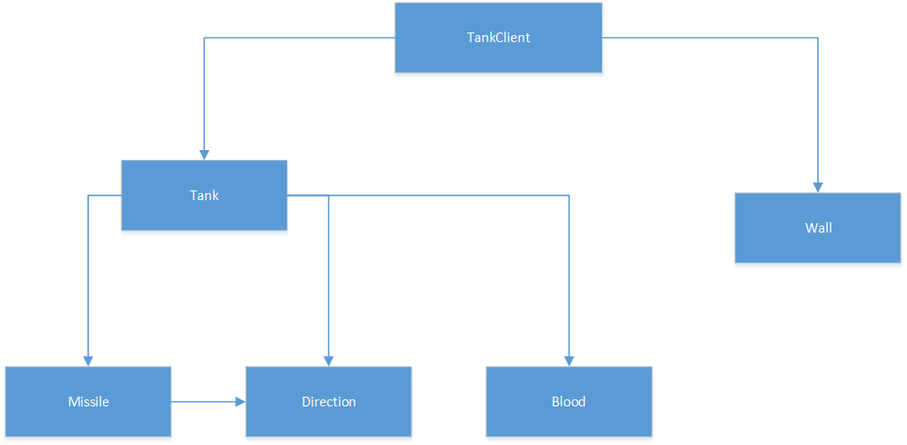

#坦克大战项目 最新修订版本
将坦克类继承线程类 
解决问题: 点击屏幕外后会自动朝原方向走不会停止的bug 
问题可能是ctrl 按键和方向 键同时按下的事件 栈溢出 丢失的bug 

方法: 将坦克每个方向的行走都走一段时间时间过后,就会停下了，不停点击这个方向,会刷新这个时间 
      如果没有检测到鼠标抬起事件他还会走一秒，然后停止 
      解决了鼠标抬起事件多按键点击栈溢出，一个方向行走不会停止的问题 
软件测试 
黑盒测试  
等价类划分: 

|输入条件|有效等价类|无效等价类|
|:-----:|:-------:|:------:|
|方向|1.上2.下3.左4.右|14.非上下左右|
|攻击|5.ctrl, 6.a或者7.A|15.非ctrl, a或者A|
|死亡后复活|8.F2|16.非F2|
|鼠标点击|9.关闭,10.最小化|17.点出去和18.乱点|
|操作|11.无操作 12.单操作 13.多操作||
测试用例: 

|输入|预计输出|覆盖等价类|
|:-----:|:-------:|:------:|
|⬆+A|开火和向上走|1.7.13|
|上左+ctrl|左上方行走|1.3.5.13|
|下右+a|右下方行走|2.4.6.13|
|死亡后复活|F2|8.12|
|鼠标点击|最小化关闭|10.9|
|不动然后按上|没反应|11|
|按qwer|没反应|14.15|
|点出去|按方向走后停住|17|
|乱点|没反应|18|
软件结构 
逻辑图： 
